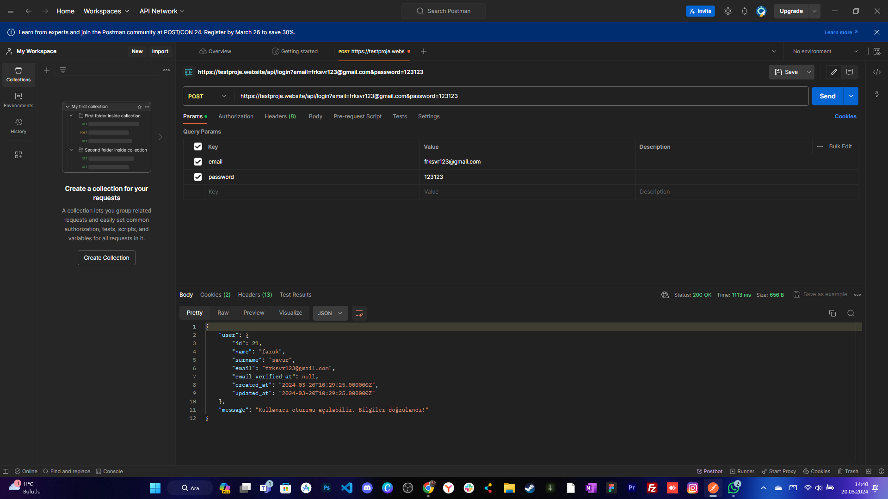
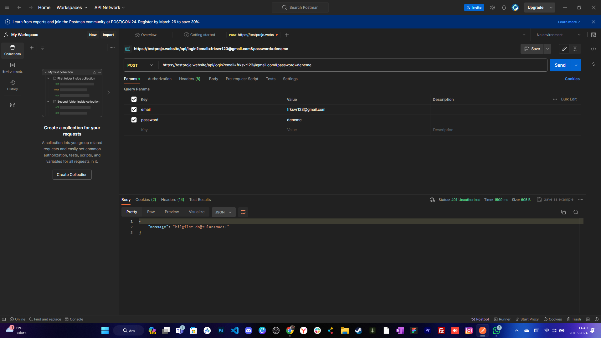

# Fast Express Test Case

* Login api laravel 10 kullanılarak yazıldı. Validasyon işlemleri yapıldı. Ek olarak ***users route*** eklendi ve kayıtlı olan kullanıcılar json formatında listelendi.
* Giriş yap, kayıt ol, yeni kargo ekle, var olan kargoları listeleme yapıldı. Ek olarak ***güncelleme*** ve ***silme*** işlemi yapıldı. Kargoların listelendiği sayfa ***laravel pagination*** kullanılarak sayfa açılış hızı artırıldı ve özelleştirildi.
* Validasyon hatalarına türkçe dil desteği eklendi.
* Ek olarak ***Auth*** (oturum yönetmi - giriş/çıkış işlemi yapıldı.)

Fast Express Test Case [fast-express](https://testproje.website/giris-yap) üzerinde canlıya alınmıştır.

## Postman için kullanım

* Login api (post) 
  * https://testproje.website/api/login
      * key: email - value: frksvr123@gmail.com
      * key: password - value: 123123

+ Users api (get)
  * https://testproje.website/api/users

## Postman önizleme
##### Doğru bilgiler ile post işlemi


##### Yanlış bilgiler ile post işlemi

 

## Local İçin Kullanım
```
git clone https://github.com/FarukSavur/f-express.git
```

```
composer install
```

```
npm install
```

* Önce *fast_express* adında bir ( *utf8mb4_unicode_ci* ) database oluşturuyoruz.
* Sonrasında url'e *http://127.0.0.1:8000/seed* yazarak tabloların database'e eklenmesine ve fake datalarında tablolara eklenmesini sağlıyoruz.

### Kargoların listelendiği sayfası tasarımı


### Kargo oluştur sayfası tasarımı


### Kargo detayları sayfası tasarımı


### Login sayfası tasarımı


### Login sayfası validasyon örneği


### Register sayfası validasyon örneği

